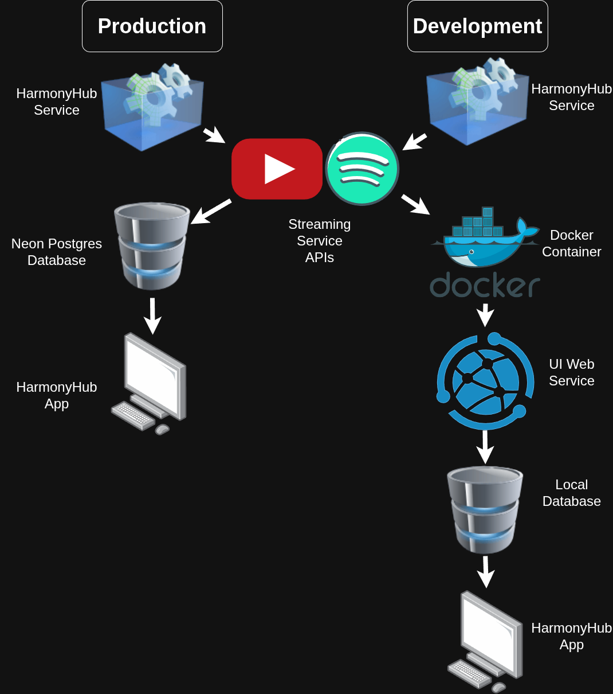

# HarmonyHub

Senior Design Project

## Tech Stack

- Framework: Next.js
- Database: PostgreSQL, Prisma ORM, Better Auth, and Neon for database hosting
- UI/Styling: Tailwind CSS and shadcn
- Testing: Jest and PlayWright
- Code Quality: ESLint, Prettier, and TypeScript
- Local Dev Environment: Docker

Note: Some of this information with specific version numbers can be found in [`package.json`](package.json).

## Project Structure

```text
app/            # Next.js app router
└─ api/         # Where request handlers are nested (Next.js route.ts files)
components/     # Reusable UI components
└─ ui/          # Basic component building blocks
docs/           # Documentation related files
hooks/          # Reusable custom react hooks
lib/            # Utility functions
public/         # Static files/assets
services/       # For backend related functions (e.g. API and database)
tests/          # Where tests are stored
├─ e2e/         # Playwright end-to-end test files
└─ unit/        # Jest unit test files
.env.example    # Showcase of important environment variables
components.json # Config file for shadcn
envConfig.ts    # For loading environment variables outside Next.js
jest.setup.ts   # Set up code run before every Jest test and mocks
middleware.ts   # Next.js Middleware
```

## Development Environment

### Prerequisites

- Node (v24 recommended)
- npm
- Docker
- Python
- Visual Studio Code

### First Time Set Up

1. Clone the project to a local directory.
2. Open the project in Visual Studio Code.
3. Download the Visual Studio Code extensions recommended by our workspace (should prompt you, but extensions can be found in [`.vscode/extensions.json`](.vscode/extensions.json) if not).
4. Create and active a Python virtual environment using `python3 -m venv .venv` and `.venv\Scripts\Activate.ps1` (activate command differs depending on the platform and shell. see [the Python docs](https://docs.python.org/3/library/venv.html#how-venvs-work) for your platforms specific command).
5. Run `npm install`.
6. Run `npx prisma generate` and `npx next typegen` to generate needed types.
7. Create a copy of `.env.example` renamed to `.env` in the root directory of the project.
8. In your new `.env` file, fill the empty values from `.env.example` with our secret ones.
9. Run the command `docker compose up -d db` to start a local PostgresSQL database.
10. If desired, run `npx prisma db seed` to fill your local database with test data.
11. Run `npm run dev` to start the app.
12. Open the app by going to `127.0.0.1:3000`.

Note 1: `npm run dev` and `npm start` both run the Next.js app and the local FastAPI YouTube service.

Note 2: Set `YTMUSIC_API_BASE_URL` in your `.env` if your YouTube FastAPI service runs somewhere other than `http://127.0.0.1:8000`.

## Troubleshooting

### Type Issues

If you are getting type errors, make sure to run `npm install`, `npx next typegen`, and `npx prisma generate` to ensure all the necessary types have been created.

## Architecture Diagram



## Project Plan Links

GitHub Projects: <https://github.com/users/suprads/projects/2>

OneDrive: <https://mailuc.sharepoint.com/:f:/r/sites/SeniorDesign2526-Prof.Dekok-Group52/Shared%20Documents/Group%2052%20-%20Harmony%20Hub?csf=1&web=1&e=WZB0To>
